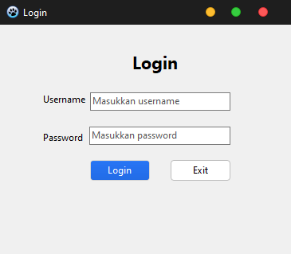
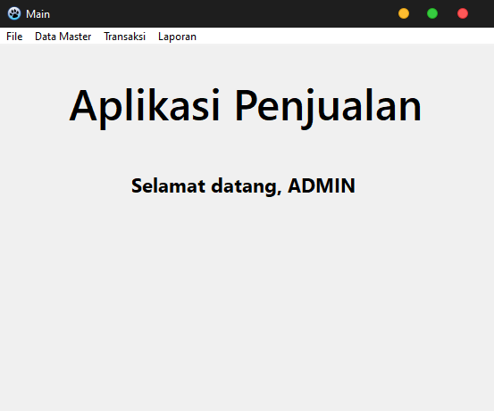
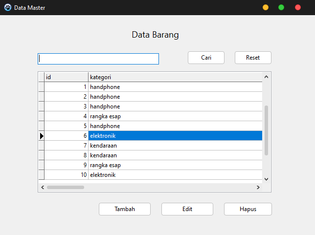
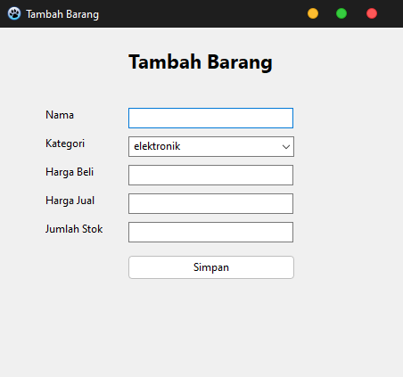
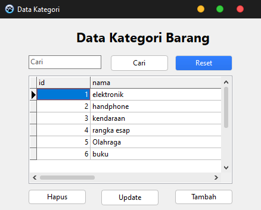
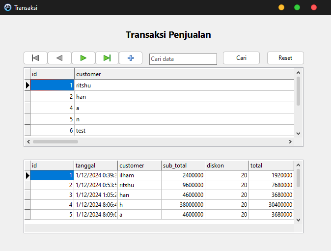
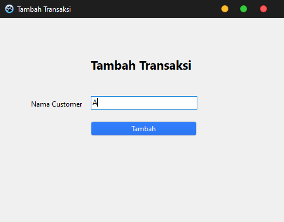
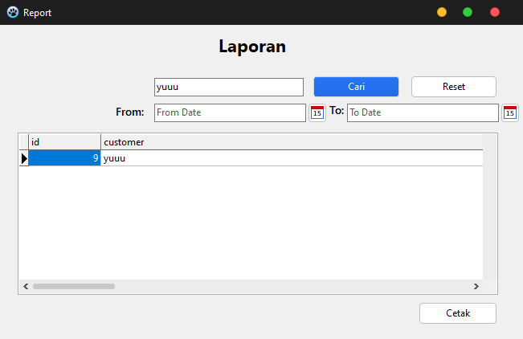
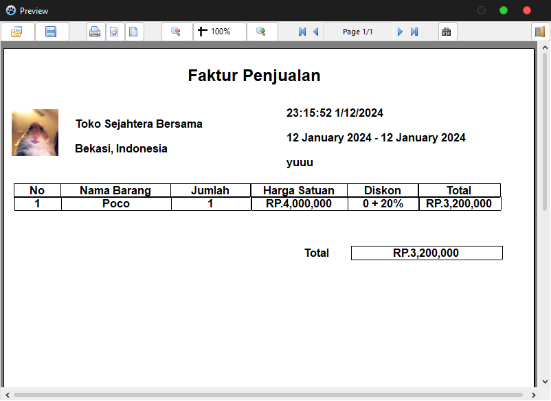
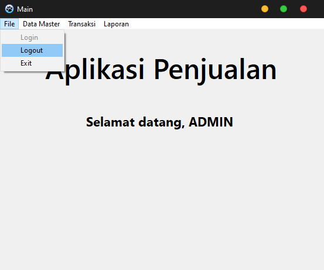

## UAS - Pemrograman Visual

```bash
Nama    : Ilham Nur Utomo
Kelas   : TI.20.A.RPL.-1
Nim     : 312010129
``` 

### Demo

```bash
Youtube : https://youtu.be/niJdPzkbL_0
```

1. Login

2. Dashboard

1. Data Barang

1. Tambah Barang

1. Kategori Barang

1. Transaksi Penjualan

1. Tambah Transaksi

1. Laporan

1.  Laporan Detail

1.  Logout
